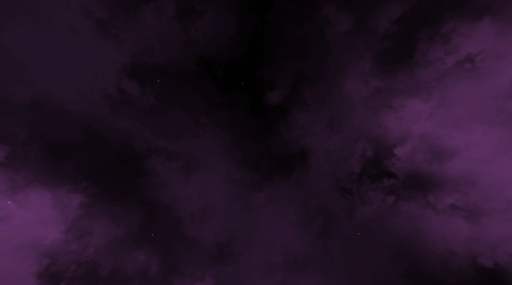
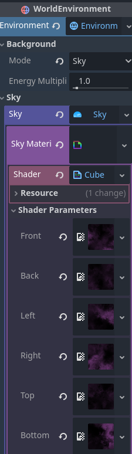

### Cubemap Skybox Shader for godot

Cubemap (6 images) Skybox Shader for godot.

#### Installation

Just copy the shader file into your project.

#### Usage

- Add a `WorldEnvironment` node.
- Assign an `Environment` to it.
- From Background property select `Sky`.
- After adding the sky, assign a `ShaderMaterial` to its material.
- Finally assign the shader to the Sky Shader property.

#### Notes.

You can create the images using your favorite graphic editor.

or you can generate one at:
https://tools.wwwtyro.net/space-3d/index.html